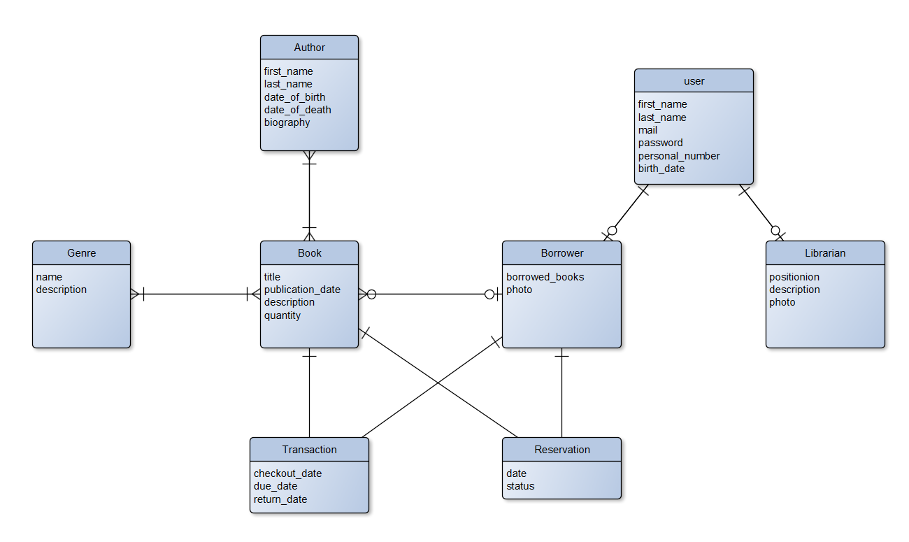

# Django Library Management System

## Description

This is a library management system built with Django, primarily designed as a REST API with Django REST framework. It allows users to borrow and return books, while staff can add, update, and delete books. The system also manages transactions, allowing staff to view all transactions, filter them by date, and search for specific transactions.

Although the core functionality is provided via a REST API, the project also includes some templates rendered for the frontend to facilitate basic interactions with the system. The authentication system is built using Django's built-in authentication framework.


## Features

- REST API for managing books, authors, genres, borrowers, 
- transactions, and statistics related to the library.
- User authentication and authorization
- Staff functionalities to add, update, and delete books
- Transaction management with filtering and search capabilities
- Rendered templates for basic frontend interactions
- Admin panel for managing users, books, authors, genres, and borrowers
- Custom management commands for updating reservations and control transactions.
- send email to the user when the return date for the book is overdue
- see other features in the project

## API Endpoints

The core functionality is accessible via REST API endpoints. 
To view the detailed API documentation, see the swagger documentation at
    
    http://127.0.0.1:8000/swagger/


## Installation

1. **Clone the repository**
2. **Install Pipenv:**

    If you don't have Pipenv installed, you can install it using pip:

    ```sh
    pip install pipenv
    ```

3. **Install dependencies:**

    Pipenv will read the `Pipfile` and install all required dependencies:

    ```sh
    pipenv install
    ```

4. **Create and configure your `.env` file:**

    Create a `.env` file in the project root directory and add the following configurations:

    ```
    DB_NAME=
    DB_USER=
    DB_PASSWORD=
    DB_HOST=
    DB_PORT=
    
    EMAIL_BACKEND=django.core.mail.backends.smtp.EmailBackend
    EMAIL_HOST=
    EMAIL_PORT=
    EMAIL_USE_TLS=
    EMAIL_HOST_USER=
    EMAIL_HOST_PASSWORD=
    ```

5. **Activate the virtual environment:**

    ```sh
    pipenv shell
    ```

6. **Apply migrations:**

    ```sh
    python manage.py migrate
    ```

7. **Create a superuser:**

    ```sh
    python manage.py createsuperuser
    ```

8. **Run the development server:**

    ```sh
    python manage.py runserver
    ```

9. Open your web browser and go to `http://127.0.0.1:8000/` to see the application.


### Admin Panel

Access the admin panel at `http://127.0.0.1:8000/admin/` to manage users, books, authors, genres, and borrowers. Use the superuser credentials created earlier to log in.


## Contributing

1. Fork the repository
2. Create a new branch (`git checkout -b feature/your-feature`)
3. Commit your changes (`git commit -m 'Add some feature'`)
4. Push to the branch (`git push origin feature/your-feature`)
5. Open a pull request

## Acknowledgements

- Django Documentation: https://docs.djangoproject.com/
- Django REST Framework: https://www.django-rest-framework.org/
- Pipenv Documentation: https://pipenv.pypa.io/en/latest/~~
